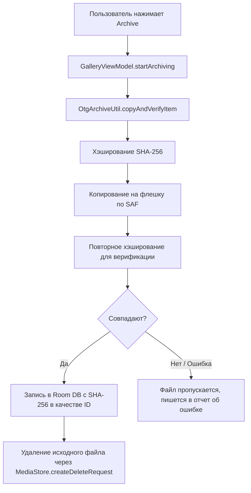
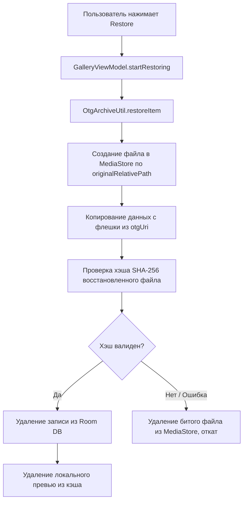
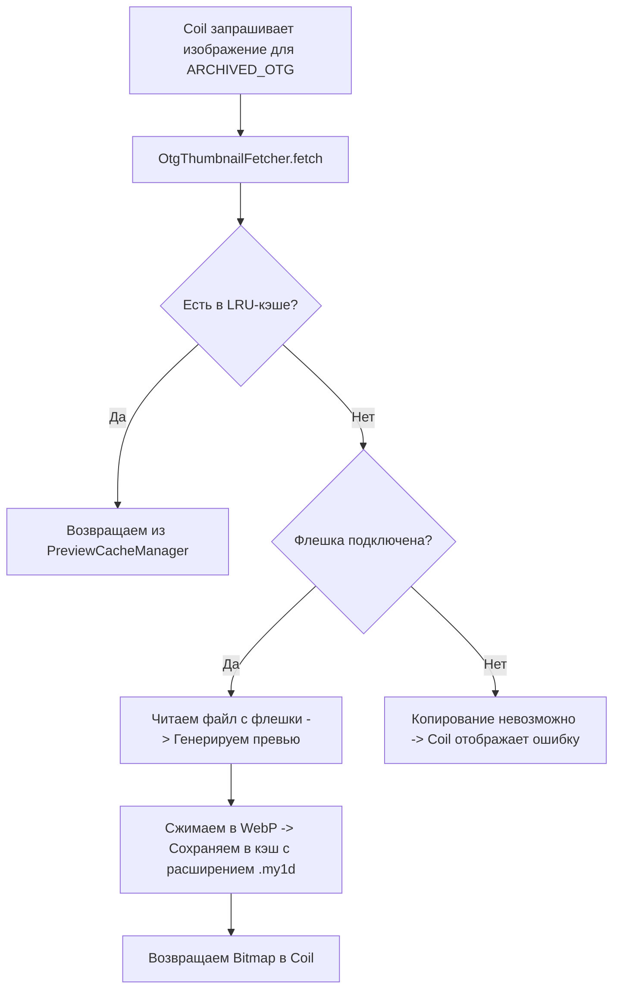

# Архитектура My1Drive (LLM-Friendly)

Документ описывает структуру проекта, потоки данных и ключевые правила разработки для быстрого входа моделей и агентов в контекст проекта.

---

## 📌 Общий концепт
Приложение предназначено для резервного копирования (архивации) локальных фото/видео из [MediaStore](https://developer.android.com/reference/android/provider/MediaStore) на OTG-накопитель (флешку) через Storage Access Framework (SAF) и их последующего восстановления.

* **Идентификация по SHA-256:** Каждый файл хэшируется при архивации. Хэш служит уникальным `PrimaryKey` (`id`/`hash`) в Room.
* **Единый список медиа:** Интерфейс склеивает локальные файлы (`ON_DEVICE`) и архивные копии (`ARCHIVED_OTG`) в единый поток.
* **Ленивые превью (Lazy caching):** Превью файлов на OTG генерируются Coil'ом лениво только при просмотре и сохраняются во внутреннем LRU-кэше приложения.

---

## 🛠️ Стек технологий
* **UI:** Jetpack Compose, Coil (с кастомным Fetcher).
* **БД:** Room Database.
* **Асинхронность:** Coroutines, Flow / StateFlow.
* **Работа с файлами:** DocumentFile (SAF) для OTG, ContentResolver для MediaStore.

---

## 📁 Структура проекта и ключевые компоненты

Корневой пакет исходного кода: `android/app/src/main/java/by/w6/my1drive/`

### 1. Domain (Модели и логический слой)
* [MediaItem](file:///d:/My1drive/android/app/src/main/java/by/w6/my1drive/domain/model/MediaItem.kt) — Представление медиафайла для UI. Содержит статус: `ON_DEVICE` или `ARCHIVED_OTG`.
* [MediaStatus](file:///d:/My1drive/android/app/src/main/java/by/w6/my1drive/domain/model/MediaStatus.kt) — Enum со статусами: `ON_DEVICE`, `ARCHIVED_OTG`.
* [MediaRepository](file:///d:/My1drive/android/app/src/main/java/by/w6/my1drive/domain/repository/MediaRepository.kt) — Интерфейс для получения списка медиа и управления архивом.

### 2. Data (База данных и Репозиторий)
* [AppDatabase](file:///d:/My1drive/android/app/src/main/java/by/w6/my1drive/data/local/AppDatabase.kt) — Room БД (версия 3, схема миграций).
* [MediaEntity](file:///d:/My1drive/android/app/src/main/java/by/w6/my1drive/data/local/MediaEntity.kt) — Описание таблицы `media_archive`. Первичный ключ `id` = SHA-256 строка. Хранит `otgUri` (URI файла на флешке) и `originalRelativePath` (папка на устройстве, откуда был взят файл).
* [MediaDao](file:///d:/My1drive/android/app/src/main/java/by/w6/my1drive/data/local/MediaDao.kt) — DAO запросы: получение отсортированного Flow, очистка, LRU-запросы.
* [MediaRepositoryImpl](file:///d:/My1drive/android/app/src/main/java/by/w6/my1drive/data/repository/MediaRepositoryImpl.kt) — Запрашивает локальные файлы через MediaStore и архивные из Room, дедуплицирует по имени/размеру и возвращает единый `Flow<List<MediaItem>>`.

### 3. Utils (Файловый I/O и Кэширование)
* [OtgArchiveUtil](file:///d:/My1drive/android/app/src/main/java/by/w6/my1drive/utils/OtgArchiveUtil.kt) — Логика архивации/восстановления. Выполняет SHA-256 хэширование, копирование потоков данных, восстановление в MediaStore. Обрабатывает исключения (пропуск недоступных/облачных файлов через `CopyVerifyResult.Skipped`).
* [PreviewCacheManager](file:///d:/My1drive/android/app/src/main/java/by/w6/my1drive/utils/PreviewCacheManager.kt) — Менеджер LRU-кэша в `filesDir/my1drive_previews/` (расширение `.my1d` для скрытия превью от галерей). Лимит кэша по умолчанию 500 МБ.
* [OtgThumbnailFetcher](file:///d:/My1drive/android/app/src/main/java/by/w6/my1drive/utils/OtgThumbnailFetcher.kt) — Кастомный fetcher для Coil. Позволяет загружать превью на лету с флешки (если подключена) и сохранять их в кэш.

### 4. UI (Компоненты и логика представления)
* [MainActivity](file:///d:/My1drive/android/app/src/main/java/by/w6/my1drive/MainActivity.kt) — Activity приложения. Запрашивает SAF-разрешения для OTG, READ_MEDIA разрешения (включая частичный доступ на Android 14+), слушает Intent-ы подключения/отключения флешек.
* [GalleryViewModel](file:///d:/My1drive/android/app/src/main/java/by/w6/my1drive/ui/GalleryViewModel.kt) — Управление состояниями (выбранные файлы, прогресс бэкапа/восстановления/удаления), вызовы фоновых корутин.
* [ArchiveSyncHelper](file:///d:/My1drive/android/app/src/main/java/by/w6/my1drive/ui/ArchiveSyncHelper.kt) — Helper для проверки доступности архивных файлов на OTG (тихая синхронизация).
* Экран галереи:
  * [GalleryScreen](file:///d:/My1drive/android/app/src/main/java/by/w6/my1drive/ui/GalleryScreen.kt) — Главная обертка экрана.
  * [GalleryScreenContent](file:///d:/My1drive/android/app/src/main/java/by/w6/my1drive/ui/GalleryScreenContent.kt) — Навигация по вкладкам.
  * [PhotosGridTab](file:///d:/My1drive/android/app/src/main/java/by/w6/my1drive/ui/PhotosGridTab.kt) — Сетка фото с разбивкой по датам (`DateCategoryHeader`).
  * [GooglePhotosGridItem](file:///d:/My1drive/android/app/src/main/java/by/w6/my1drive/ui/GooglePhotosGridItem.kt) — Интерактивная карточка фото (поддержка выделения, отображение статусов).
  * [SettingsTab](file:///d:/My1drive/android/app/src/main/java/by/w6/my1drive/ui/SettingsTab.kt) — Настройки приложения, выбор пути к OTG, лимит кэша.

---

## 🔄 Основные потоки данных (Data Flows)

### 📤 1. Архивация (Бэкап)

### 📥 2. Восстановление (Restore)

### 🖼️ 3. Ленивое превью OTG-файлов

---

## 🚨 Ключевые правила разработки (Strict Constraints)

1. **SHA-256 в качестве Primary Key:** Всегда используйте SHA-256 хэш файла как уникальный идентификатор в Room ([MediaEntity](file:///d:/My1drive/android/app/src/main/java/by/w6/my1drive/data/local/MediaEntity.kt)). Никаких случайных UUID.
2. **Одна флешка — один архив:** Приложение поддерживает только одну активную целевую папку на одном OTG-устройстве.
3. **Безопасность файловых операций (Android 14+ / Android 16):**
   - Для Android 14+ обязателен запрос `READ_MEDIA_VISUAL_USER_SELECTED`. Если доступ частичный, выводится предупреждение.
   - Любое чтение из галереи может бросить `SecurityException` (особенно на Android 16 для "облачных" файлов Google Фото). Ошибки должны изолироваться на уровне отдельных файлов (помечаться как `Skipped`), не ломая всю операцию архивации.
4. **Ленивая генерация превью:** Превью файлов на флешке **никогда** не генерируются при архивации. Только при непосредственном отображении в сетке галереи через [OtgThumbnailFetcher](file:///d:/My1drive/android/app/src/main/java/by/w6/my1drive/utils/OtgThumbnailFetcher.kt).
5. **Потокобезопасность:** Все тяжелые расчеты (SHA-256, I/O потоки, сжатие картинок) должны запускаться исключительно на пуле потоков `Dispatchers.IO`.
6. **Размер файлов:** Не допускайте разрастания кодовой базы в одном файле. Если класс UI/ViewModel превышает 400 строк, выносите логику в хелперы (например, [ArchiveSyncHelper](file:///d:/My1drive/android/app/src/main/java/by/w6/my1drive/ui/ArchiveSyncHelper.kt)).
